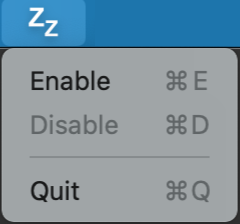

# DoNotZz (i.e. don't sleep)

An application to keep you Mac awake. I wrote this project some time back to solve a number of problems I was facing when my Mac would fall asleep:

* Long downloads would get interrupted
* Certain deployment jobs would fail
* Presentations would get disconnected

It was something I put together in a single night, without having every written anything in Swift. The years to follow I would make superficial updates but my Swift knowledge has not changed, so bear that in mind when looking at the code.

Still, it has served me well these past few years and even though there are now more sophisticated apps on the market, I enjoy the simplicity of _DoNotZz_ and keep using it.

## User's Guide

Once started, the application should appear on your Menu Bar. By default the application is started in a _Disabled_ state.

To keep your system awake, click on the app's icon and select the `Enable` option. The icon will change in the Menu Bar to indicate it is running. Similarly, use `Disable` to allow the system to go to sleep.

The application does not make any intrusive adjustments to your system. It fakes running an activity that needs the system awake (similar to what happens when playing a video).

**Note:** When enabled, locking the Mac with `ctrl + cmd + q` does not cause the system to sleep, but closing the lid still does.
